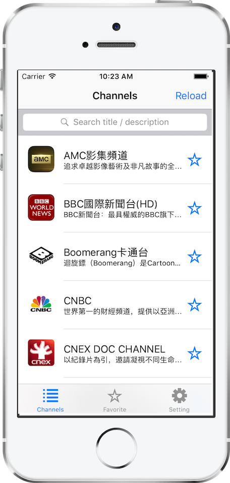

# WatchTV #

[__Latest: 2.0.7__][Latest]

觀看電視節目的 iOS universal app.  
支援 **PictureInPicture**, **AirPlay**.




## 安裝 ##


### 使用 Cydia Impactor ###
下載最後一個版本的 [ipa][Latest] 檔, 再利用 [Cydia Impactor][cydia] 安裝.

### 使用 Xcode ###

[](https://github.com/Carthage/Carthage)

請先安裝 [Carthage][Carthage].

```shell
carthage update --platform iOS
```

Xcode build and run.


[Carthage]: https://github.com/Carthage/Carthage "Carthage"
[Latest]: https://github.com/shinrenpan/WatchTV-Client/releases/latest
[cydia]: http://www.cydiaimpactor.com
